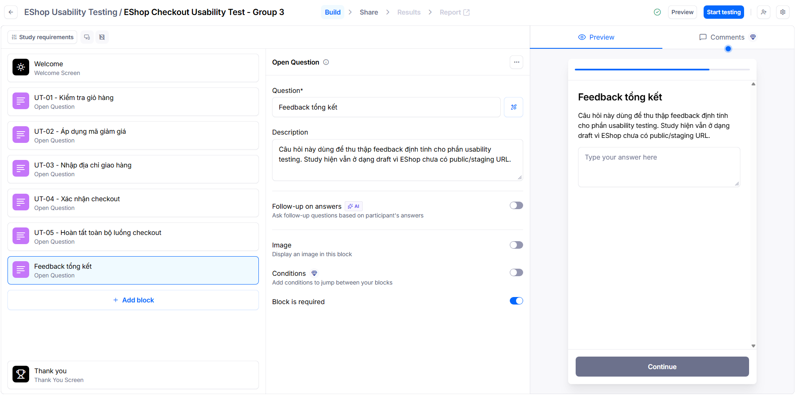

# User Guide: Usability Testing for EShop Checkout with Maze

> Seminar topic: T01 - GUI & Usability Testing  
> Responsible part: Usability Testing  
> Main tool: Maze  
> System under test: EShop checkout flow

---

## 1. Introduction

This guide explains how to run a usability test for the EShop checkout flow using Maze. The goal is to check whether users can complete the main checkout tasks smoothly, where they hesitate, where they misclick, and which parts of the flow should be improved.

The usability test focuses on the following checkout steps:

| Step | Area | What we want to observe |
|---|---|---|
| 1 | Cart review | Whether users understand product quantity, price, and total cost |
| 2 | Coupon | Whether users can apply a discount code and notice the result |
| 3 | Shipping address | Whether users can complete required delivery information |
| 4 | Payment | Whether users can choose a payment method and understand validation feedback |
| 5 | Order confirmation | Whether users know the checkout process is complete |

Maze is used because it supports task-based usability testing and can collect useful evidence such as task success, time on task, misclicks, user paths, and open-ended feedback. These metrics help the team turn user behavior into concrete usability findings.

This guide does not include fabricated test results. All result tables must be completed only after the Maze study is actually run.

---

## 2. Install / Setup

### 2.1 Create the Maze workspace

1. Go to Maze and create or log in to a team account.
2. Create a new project for the EShop checkout usability test.
3. Choose the study type that matches the available EShop material:
   - Use a website test if the EShop checkout has a public or staging URL.
   - Use a prototype test if the checkout flow is available as a Figma, Sketch, Adobe XD, or similar prototype.
   - Use draft/open-question blocks only if the real website or prototype is not ready yet.

Do not use a private localhost URL as the final study URL unless participants can access it through a proper tunnel or staging setup. A Maze study should be tested from a participant device before being shared.

### 2.2 Run the EShop SUT locally

The EShop SUT source has been cloned into this workspace from:

```text
https://github.com/ttbhanh/eshop-sut
```

Relevant local folders:

| Component | Folder | Local URL |
|---|---|---|
| Backend API | `eshop-sut/backend` | `http://localhost:3000` |
| Frontend Web | `eshop-sut/frontend-web` | `http://localhost:5173` |

Local startup steps:

```bash
cd eshop-sut/backend
npm install
node database.js
node server.js
```

Open a second terminal for the web frontend:

```bash
cd eshop-sut/frontend-web
npm install
npm run dev
```

Default test account from the SUT documentation:

| Role | Email | Password |
|---|---|---|
| User | `test@eshop.com` | `Test1234!` |

Useful coupon codes from the SUT documentation:

| Code | Type | Requirement | Note |
|---|---|---|---|
| `SAVE10` | 10% discount | Order >= 300,000 VND | One use per user |
| `BIGBUY` | 50,000 VND discount | Order >= 500,000 VND | One use per user |
| `VIP100` | 100,000 VND discount | Order >= 300,000 VND | Two uses per user |
| `EXPIRED` | 20% discount | Expired coupon | Useful for error-state testing |

For an official Maze study, do not ask many participants to reuse the same account and coupon without resetting data or creating separate test users. Coupon usage limits can make later participants see different behavior, which would pollute the usability results.

### 2.3 Prepare the test asset

Before creating the official Maze study, prepare the target flow:

| Required item | Status |
|---|---|
| Local EShop web URL | `http://localhost:5173` |
| Local checkout route | `http://localhost:5173/checkout` |
| Local cart route | `http://localhost:5173/cart` |
| Backend API URL | `http://localhost:3000` |
| Test user account | `test@eshop.com` / `Test1234!` |
| Test coupon code for pilot | `SAVE10` or `VIP100`, depending on database state |
| Sample product for checkout task | `iPhone 15 Pro Max`, `Samsung Galaxy S24 Ultra`, or another seeded product |
| Public/staging URL for official Maze study | `[Still needed before sharing with participants]` |
| Known limitations of the test environment | Localhost works for local pilot only; official participants need public/staging access |

Do not include private passwords, real payment data, student IDs, or course-secret content in the Maze study or in AI tools.

### 2.4 Define participant criteria

The target participants should be people who can reasonably represent online shoppers. For this seminar, participants may be classmates or invited testers.

Record the participant criteria before the study starts:

| Field | Description |
|---|---|
| Target participant group | `[Fill in]` |
| Expected number of participants | `[Fill in]` |
| Required device/browser | `[Fill in]` |
| Estimated completion time | `[Fill in]` |
| Screening question, if any | `[Fill in]` |

### 2.5 Prepare evidence storage

Create a clear folder for screenshots and exported results:

```text
ai-disclosure/
weekly_reports/
releases/
```

Recommended evidence to save:

- Screenshot of Maze study setup.
- Screenshot of each task block.
- Screenshot of participant preview mode.
- Screenshot or export of Maze results after the study.
- Notes from pilot testing.
- Final summary table of findings.

---

## 3. First Test

The first test should be a small pilot, not the official class-wide study. The pilot checks whether the study link works, whether the task wording is understandable, and whether Maze records the expected data.

### 3.1 Create the Maze study

1. Open the Maze project.
2. Create a new study.
3. Add the EShop checkout URL or prototype link.
4. Name the study clearly, for example:

```text
EShop Checkout Usability Test - Pilot
```

5. Add an introduction screen explaining the scenario:

```text
You are testing an online shopping checkout flow. Please complete each task as naturally as possible. This is a test of the interface, not a test of your personal ability.
```

Current draft evidence:



The screenshot shows the draft Maze study named `EShop Checkout Usability Test - Group 3`. The study currently contains open-question blocks for UT-01 to UT-05 and a final feedback block. This is draft evidence only because the EShop checkout does not yet have a public or staging URL in the captured setup.

### 3.2 Add task scenarios

Use short and neutral task wording. Avoid telling participants exactly where to click.

| Task ID | Checkout area | Participant task | Expected behavior | Metrics to collect |
|---|---|---|---|---|
| UT-01 | Product and cart | From the product list, add one product to the cart, open the cart, and check the product name, quantity, line price, and total. | User finds `Thêm vào giỏ`, opens `Giỏ hàng`, and understands the cart summary. | Success rate, time on task, misclicks |
| UT-02 | Login and checkout entry | Log in with the provided test account and continue from cart to checkout. | User can identify the login form, sign in, return to cart if needed, and reach `/checkout`. | Success rate, time on task, drop-off |
| UT-03 | Coupon | Apply the provided coupon code, such as `SAVE10` or `VIP100`, and explain whether the discount was applied. | User enters the code, presses `Áp dụng`, and notices success or error feedback. | Success rate, misclicks, feedback |
| UT-04 | Order review | Review the order list and final amount before confirmation. Also note whether the UI provides a shipping-address confirmation step. | User understands the order summary and can report if expected checkout information is missing. | Open feedback, confusion points, time on task |
| UT-05 | Full checkout | Confirm payment/order completion and identify the final success state. | User reaches `Thanh toán thành công!` and understands that checkout is complete. | Completion rate, user path, feedback |

Important current-SUT note: the checked `frontend-web/src/pages/Checkout.jsx` page does not contain a shipping-address form. If the study keeps a task named `UT-03 - Nhập địa chỉ giao hàng`, participants may fail because the UI does not provide that step. Either revise UT-03 to match the current UI, or use it intentionally to collect feedback about the missing address-confirmation step.

### 3.3 Add post-task questions

After each important task, add one short question. Do not overload participants with too many questions.

| Question type | Question | Purpose |
|---|---|---|
| Rating | How easy was this task from 1 to 5? | Measures perceived ease |
| Open feedback | Was anything confusing in this step? | Captures qualitative pain points |
| Confidence | Are you confident that this step was completed successfully? Why? | Checks whether feedback/status is clear |
| Improvement | What would you change about this step? | Collects user suggestions |

### 3.4 Run a pilot test

Run the study with 1-2 pilot participants before publishing it to the full audience.

| Pilot check | Result |
|---|---|
| Maze link opens correctly | `[Fill in after pilot]` |
| EShop/prototype loads correctly | `[Fill in after pilot]` |
| Task wording is understandable | `[Fill in after pilot]` |
| Maze records click/path/time correctly | `[Fill in after pilot]` |
| Questions appear in the right order | `[Fill in after pilot]` |
| No sensitive data is exposed | `[Fill in after pilot]` |

If the pilot finds problems, revise the study before sharing it with the class.

### 3.5 Local self-check evidence

A local self-check of the EShop flow was completed before the official Maze participant study. The checked flow was:

```text
add product -> cart -> login -> checkout -> coupon -> confirm
```

Evidence screenshots are stored in `weekly_reports/usability_evidence/`:

| Evidence file | Purpose |
|---|---|
| [Screenshot 2026-07-11 171903.png](weekly_reports/usability_evidence/Screenshot%202026-07-11%20171903.png) | Local self-check screenshot |
| [Screenshot 2026-07-11 171919.png](weekly_reports/usability_evidence/Screenshot%202026-07-11%20171919.png) | Local self-check screenshot |
| [Screenshot 2026-07-11 172001.png](weekly_reports/usability_evidence/Screenshot%202026-07-11%20172001.png) | Local self-check screenshot |
| [Screenshot 2026-07-11 172035.png](weekly_reports/usability_evidence/Screenshot%202026-07-11%20172035.png) | Local self-check screenshot |
| [Screenshot 2026-07-11 172039.png](weekly_reports/usability_evidence/Screenshot%202026-07-11%20172039.png) | Local self-check screenshot |

These screenshots prove that the author could run the checkout flow locally. They are not Maze participant results, so they must not be used as success-rate, misclick-rate, or user-feedback evidence.

### 3.6 Publish and collect responses

After the pilot is successful:

1. Publish the Maze study.
2. Share the participant link through the agreed class channel.
3. Record the date, time, and channel used for sharing.
4. Stop collecting responses after the planned deadline.
5. Export or screenshot the Maze results for evidence.

Study record:

| Field | Value |
|---|---|
| Official study link | `[Fill in]` |
| Sharing channel | `[Fill in]` |
| Start time | `[Fill in]` |
| End time | `[Fill in]` |
| Total responses | `[Fill in after study]` |
| Valid responses | `[Fill in after filtering]` |

---

## 4. Advanced Usage

### 4.1 Read Maze metrics

Use Maze metrics as evidence, but do not treat numbers as automatic conclusions. Each metric should be interpreted with the task wording, participant behavior, and open feedback.

| Metric | Meaning | How to use it |
|---|---|---|
| Success rate | Percentage of users who completed the task | Identify tasks that block users |
| Time on task | Time needed to complete a task | Detect steps that take too long |
| Misclick rate | Clicks outside the expected path | Find confusing UI areas |
| Drop-off point | Where users abandon the flow | Locate severe friction points |
| User path | Sequence of user actions | Understand detours and repeated actions |
| Open feedback | Participant comments | Explain why a metric may be high or low |

### 4.2 Summarize task-level results

Complete this table only after the Maze study is finished.

| Task ID | Success rate | Avg/median time | Misclick or error pattern | Drop-off | Main observation |
|---|---|---|---|---|---|
| UT-01 | `[Fill in]` | `[Fill in]` | `[Fill in]` | `[Fill in]` | `[Fill in]` |
| UT-02 | `[Fill in]` | `[Fill in]` | `[Fill in]` | `[Fill in]` | `[Fill in]` |
| UT-03 | `[Fill in]` | `[Fill in]` | `[Fill in]` | `[Fill in]` | `[Fill in]` |
| UT-04 | `[Fill in]` | `[Fill in]` | `[Fill in]` | `[Fill in]` | `[Fill in]` |
| UT-05 | `[Fill in]` | `[Fill in]` | `[Fill in]` | `[Fill in]` | `[Fill in]` |

### 4.3 Convert evidence into usability findings

Each finding should be based on real evidence. A good usability finding includes the problem, evidence, severity, user impact, and suggested improvement.

| ID | Pain point | Evidence | Severity | User impact | Suggested improvement |
|---|---|---|---|---|---|
| UP-01 | `[Fill in]` | `[Maze metric / screenshot / feedback]` | `[Critical/Major/Minor/Cosmetic]` | `[Fill in]` | `[Fill in]` |
| UP-02 | `[Fill in]` | `[Maze metric / screenshot / feedback]` | `[Critical/Major/Minor/Cosmetic]` | `[Fill in]` | `[Fill in]` |
| UP-03 | `[Fill in]` | `[Maze metric / screenshot / feedback]` | `[Critical/Major/Minor/Cosmetic]` | `[Fill in]` | `[Fill in]` |

Suggested severity scale:

| Severity | Definition |
|---|---|
| Critical | Prevents users from completing checkout |
| Major | Causes serious confusion, delay, or repeated errors |
| Minor | Creates friction but users can still continue |
| Cosmetic | Visual or wording issue with low impact on completion |

### 4.4 Avoid invalid conclusions

The following conclusions are not acceptable unless supported by actual data:

- "All users found checkout easy" without participant responses.
- "Maze proved the checkout is good" without task metrics and feedback.
- "Users prefer this design" without a preference question or comparison test.
- "The issue is fixed" without retesting.
- "The result represents all customers" when the sample is only classmates.

Use careful wording:

```text
Based on the collected class-participant data, Task UT-02 showed more friction than other tasks because [evidence]. Since the participant sample is limited, this result should be treated as exploratory rather than fully representative of all EShop users.
```

### 4.5 Prepare the seminar explanation

For the live seminar, explain the usability testing process in this order:

1. Why the checkout flow was selected.
2. How the Maze study was designed.
3. What tasks participants completed.
4. What metrics were collected.
5. What the strongest usability findings were.
6. What should be improved in the EShop checkout.
7. What the limitations of the study were.

---

## 5. Troubleshooting

| Problem | Likely cause | Fix |
|---|---|---|
| Maze study link does not open | Study is not published or link is private | Check publish status and test the participant link in an incognito browser |
| EShop URL does not load for participants | Localhost/private network URL was used | Deploy to staging or use a prototype accessible to participants |
| Participants fail because they do not understand the task | Task wording is unclear or too broad | Run a pilot and rewrite the task in simpler language |
| Participants follow different paths than expected | The UI allows multiple valid routes or task goal is vague | Accept valid alternative paths or refine task success criteria |
| Maze records many misclicks | UI may be confusing, or clickable areas are not configured correctly | Inspect click map and verify Maze task setup |
| Results are too few to conclude | Not enough valid participants | Report sample size clearly and avoid broad claims |
| Feedback is too short or unhelpful | Open question is too vague | Ask a more specific post-task question |
| Metrics look inconsistent | Technical issue, participant distraction, or invalid response | Define filtering criteria and mark invalid responses transparently |
| Need to edit study after publishing | Maze plan or study state may restrict changes | Duplicate the study or document changes clearly before rerunning |
| Free-tier limit affects testing | Too many drafts or study constraints | Prepare carefully, pilot early, and avoid unnecessary duplicate studies |

---

## 6. References

- `Seminar_Guide.docx.pdf` - Stage S4 user guide requirement and seminar rubric.
- `AI Usage Guidelines.pdf` - AI usage disclosure and prohibited-use rules.
- `Tool_Survey_Proposal.md` - Tool comparison and Maze selection rationale.
- `DeepStudyHandsOn.md` - Usability testing study design and hands-on notes.
- Maze documentation: <https://help.maze.co/>
- Nielsen Norman Group, Usability Testing: <https://www.nngroup.com/articles/usability-testing-101/>
- Nielsen Norman Group, 10 Usability Heuristics: <https://www.nngroup.com/articles/ten-usability-heuristics/>

---

## 7. Appendix: AI Usage Notes

This section is included to comply with the course AI Usage Guidelines.

### 7.1 AI use declaration

AI was used to assist with drafting the structure and wording of this Markdown user guide. The guide must be reviewed, edited, and validated by the student/team before submission.

| Required detail | Entry |
|---|---|
| Tool name, version, platform | Codex, GPT-5, OpenAI/Codex |
| Access time | 2026-07-11, Asia/Bangkok |
| Purpose of use | Draft a usability-testing user guide structure and reusable Markdown content |
| Prompt summary | Create `User_Guide.md` following `Seminar_Guide.docx.pdf` and strict `AI Usage Guidelines.pdf`, scoped to Usability Testing responsibility |
| AI-generated content | Initial guide structure, tables, task templates, troubleshooting list, and AI usage appendix |
| Student/team work required | Review wording, run Maze study, collect real participant data, fill placeholders, verify findings, add screenshots/evidence, and remove any inaccurate statements |
| Evidence | Add screenshot or chat-history reference in `ai-disclosure/AI_Usage_Log.md` |

### 7.2 Human validation checklist

Before submitting this guide, the responsible student/team must confirm:

| Check | Status |
|---|---|
| All Maze links are real and accessible | `[To confirm]` |
| Pilot test was actually run | `[To confirm]` |
| Participant count is real | `[To confirm]` |
| Maze metrics are copied from actual results | `[To confirm]` |
| Open feedback is quoted or summarized honestly | `[To confirm]` |
| No fake audience feedback is included | `[To confirm]` |
| No private data is included | `[To confirm]` |
| AI-assisted text was reviewed and edited by the student/team | `[To confirm]` |
| Screenshots or chat history are saved as evidence | `[To confirm]` |

### 7.3 Prohibited use reminder

Do not use AI to generate fake study results, fake participant comments, fake screenshots, fake attendance, or final conclusions that are not supported by actual Maze evidence.

