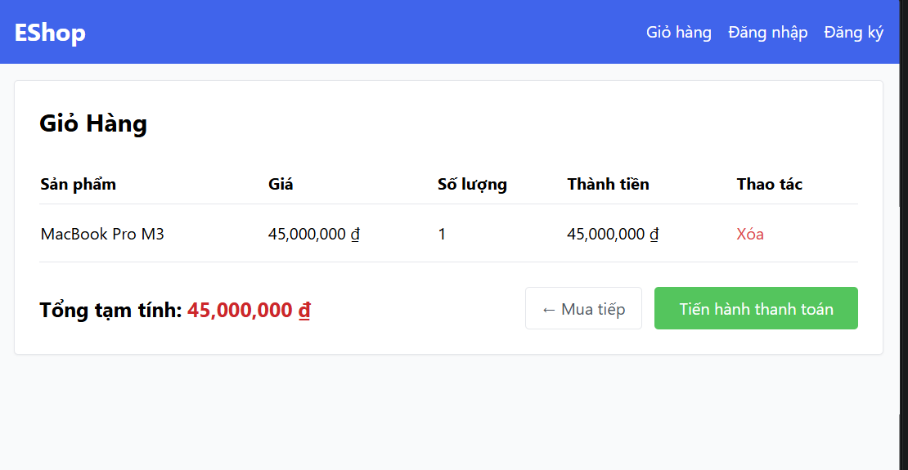
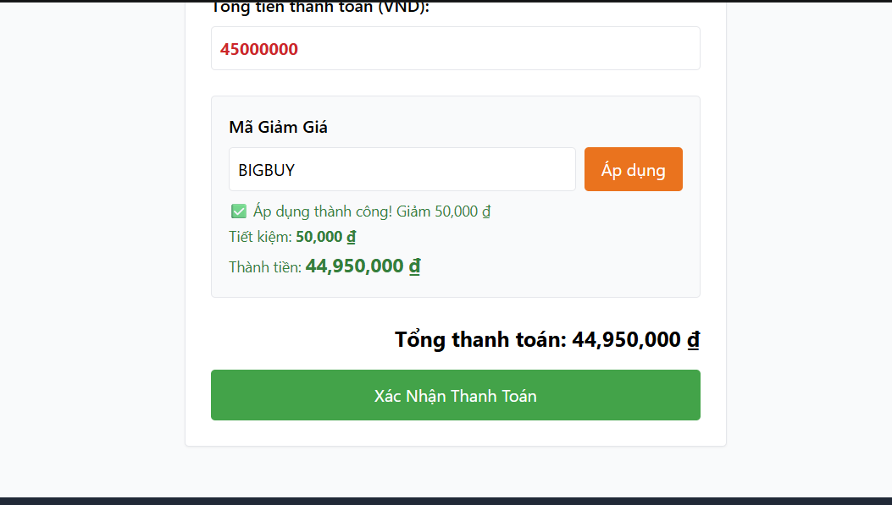
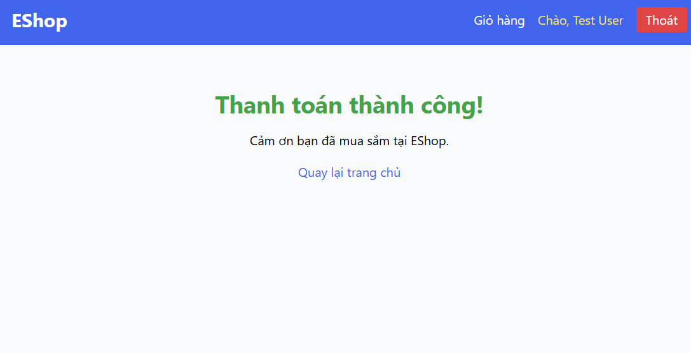

# T01 - GUI & Usability Testing

**Responsible:** 23127149 - Nguyễn Bình An; 23127027 - Phạm Ngọc Gia Bảo; 23127035 - Lee Kun Da; 23127327 - Lưu Ngô Quốc Bảo

## A Reproducible User Guide for EShop Checkout

**Responsible:** 23127149 - Nguyễn Bình An; 23127027 - Phạm Ngọc Gia Bảo; 23127035 - Lee Kun Da; 23127327 - Lưu Ngô Quốc Bảo

**Course:** CSC13003 - Software Testing  
**Class:** 23KTPM4  
**Group:** 03  
**System under test:** EShop checkout  
**Demo video (YouTube Unlisted):** `VIDEO_LINK_REQUIRED`

| Student ID | Full name |
|---|---|
| 23127149 | Nguyễn Bình An |
| 23127027 | Phạm Ngọc Gia Bảo |
| 23127035 | Lee Kun Da |
| 23127327 | Lưu Ngô Quốc Bảo |

> **Document status:** Markdown regenerated on 2026-07-23. The existing PDF has not been regenerated and is now obsolete. Do not submit the old PDF with this Markdown.

---

# How to use this guide

**Responsible:** 23127149 - Nguyễn Bình An; 23127027 - Phạm Ngọc Gia Bảo; 23127035 - Lee Kun Da; 23127327 - Lưu Ngô Quốc Bảo

This report is the final **User Guide** for the seminar topic. It is written for a reader who has not followed the group project and needs to start quickly without reconstructing the workflow from scattered notes.

Follow the guide in this order:

1. Read the scope and choose the testing track.
2. Prepare and run the EShop system.
3. Complete one UI-testing pass with BrowserStack Live and Claude Vision.
4. Complete one usability study with Maze.
5. Save evidence and convert only verified observations into findings.
6. Use the advanced, troubleshooting, and seminar-runbook sections when needed.

The guide intentionally separates three kinds of evidence:

- **Local self-check evidence:** proves that the EShop flow can run.
- **Test execution evidence:** proves what happened in a named browser, device, or Maze study.
- **Verified finding:** a claim supported by reproducible evidence and reviewed by a human.

An AI suggestion, a local screenshot, or a draft Maze study is not automatically a verified finding.

---

# 1. Introduction

**Responsible:** 23127149 - Nguyễn Bình An; 23127027 - Phạm Ngọc Gia Bảo; 23127035 - Lee Kun Da; 23127327 - Lưu Ngô Quốc Bảo

## 1.1 What this seminar teaches

**Responsible:** 23127149 - Nguyễn Bình An; 23127027 - Phạm Ngọc Gia Bảo; 23127035 - Lee Kun Da; 23127327 - Lưu Ngô Quốc Bảo

GUI and usability testing answer different questions:

| Testing lens | Main question | Primary evidence |
|---|---|---|
| Functional check | Did the action complete correctly? | Expected versus actual system behavior |
| GUI/UI testing | Did the interface render and react correctly in this environment? | Named browser/device, screenshots, interaction notes |
| Usability testing | Could a representative participant understand and complete the task? | Participant paths, recordings, heatmaps, answers, observations |
| AI-assisted review | What additional issues should a human inspect? | AI hypotheses followed by manual verification |

The seminar combines two practical tracks:

- **UI testing:** manual inspection in BrowserStack Live, assisted by Claude Vision.
- **Usability testing:** an unmoderated Maze study of the EShop checkout flow.

## 1.2 Scope

**Responsible:** 23127149 - Nguyễn Bình An; 23127027 - Phạm Ngọc Gia Bảo; 23127035 - Lee Kun Da; 23127327 - Lưu Ngô Quốc Bảo

The target journey is:

```text
product -> cart -> login if required -> checkout -> coupon -> amount review
        -> payment confirmation -> success state
```

While testing, observe whether the current SUT contains an address-entry or address-confirmation step. Do not assume that a screen exists only because it is common in other e-commerce systems.

This guide covers:

- local EShop setup;
- BrowserStack Local and BrowserStack Live;
- manual cross-browser and cross-device inspection;
- screenshot review with Claude Vision;
- human auditing of AI suggestions;
- Maze website testing, pilot execution, participant collection, and analysis;
- evidence management, finding templates, troubleshooting, and seminar delivery.

This guide does not provide fabricated participant results, fabricated BrowserStack defects, or an invented demo link.

## 1.3 Selected tools and when to use them

**Responsible:** 23127149 - Nguyễn Bình An; 23127035 - Lee Kun Da

| Need | Selected approach | Use it when | Do not use it as |
|---|---|---|---|
| Inspect UI on different environments | BrowserStack Live | A tester must interact with a named browser/device | Proof that every browser works without running the matrix |
| Review a private local site remotely | BrowserStack Local | BrowserStack devices must access `localhost` or staging behind a firewall | A public participant URL for Maze |
| Generate extra visual-review hypotheses | Claude Vision | Clean screenshots and a constrained prompt are available | An automatic defect oracle |
| Observe participant behavior | Maze Website Test | A public HTTPS EShop URL and a pilot-tested study are ready | Evidence of user intent without participant data |

### 1.3.1 UI tool choice

**Responsible:** 23127149 - Nguyễn Bình An

Manual testing remains the source of interaction evidence. BrowserStack Live expands the available browser/device matrix without requiring the group to own every physical device. Claude Vision is added as a second reviewer for screenshots, but every suggestion passes through a human audit before it can become a defect.

### 1.3.2 Usability tool choice

**Responsible:** 23127035 - Lee Kun Da

Maze was selected over the surveyed alternatives because it provides a guided workflow for task-based studies and a result dashboard that can combine paths, heatmaps, recordings, and questions depending on the Website Test configuration. The team must verify current plan limits and available features in its own Maze workspace before publishing.

---

# 2. Installation and preparation

**Responsible:** 23127327 - Lưu Ngô Quốc Bảo; 23127035 - Lee Kun Da; 23127027 - Phạm Ngọc Gia Bảo

## 2.1 Prerequisites

**Responsible:** 23127327 - Lưu Ngô Quốc Bảo

Prepare:

- Git;
- a supported Node.js LTS version and npm;
- three terminal windows;
- a modern local browser;
- a BrowserStack account with Live access;
- the BrowserStack Local application or binary;
- a Claude account that accepts image input;
- a Maze workspace;
- a controlled public HTTPS URL for the participant study;
- test-only EShop accounts and seeded data.

Do not upload real customer information, real payment information, access keys, private environment variables, or course-secret data to BrowserStack, Maze, or an AI tool.

## 2.2 Obtain and start EShop

**Responsible:** 23127327 - Lưu Ngô Quốc Bảo

Clone the SUT into a working directory:

```bash
git clone https://github.com/ttbhanh/eshop-sut.git
cd eshop-sut
```

Start the backend in terminal 1:

```bash
cd backend
npm install
node database.js
node server.js
```

`node database.js` initializes or resets the SQLite data used by the test accounts, products, and coupons. Back up any data that must be retained before resetting.

Start the customer frontend in terminal 2:

```bash
cd frontend-web
npm install
npm run dev
```

Optionally start the admin frontend in terminal 3:

```bash
cd frontend-admin
npm install
npm run dev
```

Expected local endpoints from the project documentation:

| Component | Expected URL |
|---|---|
| Backend API | `http://localhost:3000` |
| Customer frontend | `http://localhost:5173` |
| Admin frontend, optional | `http://localhost:5174` |

If the terminal prints different ports, use the actual ports and record them in the evidence log.

## 2.3 Verify the seeded checkout data

**Responsible:** 23127327 - Lưu Ngô Quốc Bảo

The source documentation identifies the following test-only account:

| Role | Email | Password |
|---|---|---|
| Customer | `test@eshop.com` | `Test1234!` |

Seeded coupon cases include:

| Code | Intended test purpose |
|---|---|
| `SAVE10` | percentage discount with a minimum-order rule |
| `BIGBUY` | fixed-value discount with a minimum-order rule |
| `VIP100` | fixed-value discount with a usage limit |
| `EXPIRED` | expired-coupon error state |

Before a shared test:

1. Add a seeded product to the cart.
2. Sign in with a test-only account.
3. Apply the selected coupon once.
4. Complete checkout.
5. Reset the database or prepare isolated users for the next participant.

Coupon usage limits and shared carts can make participants see different states. A stable study requires a repeatable seed/reset plan.

## 2.4 Prepare BrowserStack Local

**Responsible:** 23127327 - Lưu Ngô Quốc Bảo

1. Sign in to BrowserStack and open the Live dashboard.
2. Install the BrowserStack Local application or download the Local binary for the host operating system.
3. Start the Local application and connect it to the signed-in Live session.
4. Confirm that the Local Testing indicator in Live is green.
5. Open `http://localhost:5173` in the remote desktop browser.
6. On an iOS Live device, use `http://bs-local.com:5173` if `localhost` is not rewritten automatically.

If using the binary, follow BrowserStack's official command for the current platform and provide the access key through the approved secure mechanism. Never commit the access key.

## 2.5 Prepare the UI-testing workspace

**Responsible:** 23127327 - Lưu Ngô Quốc Bảo

Create a simple evidence structure:

```text
evidence/
├── ui/
│   ├── browserstack/
│   ├── claude-review/
│   └── findings/
└── usability/
    ├── maze-setup/
    ├── maze-results/
    └── findings/
```

Prepare a minimal risk-based matrix before opening a paid or time-limited session:

| Priority | Environment | Main risk |
|---|---|---|
| P0 | Windows + Chrome | primary desktop rendering and interaction |
| P1 | Windows + Firefox or Edge | engine-specific CSS and focus behavior |
| P1 | macOS + Safari | WebKit rendering |
| P1 | Android device | narrow viewport, touch targets, virtual keyboard |
| P1 | iPhone + Mobile Safari | viewport, touch, and WebKit behavior |

Record exact OS, browser version, device, viewport, seed state, and execution time. “Latest browser” is not sufficient evidence after the session ends.

## 2.6 Prepare a public EShop environment for Maze

**Responsible:** 23127035 - Lee Kun Da; 23127027 - Phạm Ngọc Gia Bảo

Maze participants cannot use the author's private `localhost` directly. Prepare one of:

- a controlled staging deployment;
- a temporary HTTPS tunnel that remains available throughout the study;
- an accessible prototype when live-site testing is not possible.

Record the final value here:

```text
PUBLIC_ESHOP_URL_REQUIRED
```

Preflight the public URL in an incognito window and on a second device. Verify:

- the URL uses HTTPS and does not expose an administration page;
- the complete checkout path is reachable;
- test credentials work;
- seeded products and coupons are stable;
- no participant must enter personal or payment data;
- the environment can be reset between sessions;
- the link will remain active until collection ends.

## 2.7 Choose the Maze Website Test mode

**Responsible:** 23127035 - Lee Kun Da; 23127027 - Phạm Ngọc Gia Bảo

Use the mode that matches the access available to the team:

| Mode | Setup | Evidence available | Use when |
|---|---|---|---|
| Snippet-based Website Test | Install and verify the Maze snippet on the owned test site | paths, heatmaps, and richer quantitative data, subject to current plan/features | the team is authorized to change the staging frontend |
| Snippet-less Website Test | Paste a public URL without changing the site | recordings become the main behavioral source; heatmaps and path metrics are limited | the team cannot install the snippet |
| Prototype Free Explore | Import an interactive prototype and provide an open task | paths/click evidence without predefined success metrics | a live site is unavailable but a usable prototype exists |

Write down the selected mode before designing the analysis. Never report success rate, misclick rate, heatmaps, or recordings unless that evidence is actually available in the chosen configuration.

---

# 3. First end-to-end test

**Responsible:** 23127327 - Lưu Ngô Quốc Bảo; 23127149 - Nguyễn Bình An; 23127035 - Lee Kun Da; 23127027 - Phạm Ngọc Gia Bảo

## 3.1 First UI test in BrowserStack Live

**Responsible:** 23127327 - Lưu Ngô Quốc Bảo

### 3.1.1 Launch the session

**Responsible:** 23127327 - Lưu Ngô Quốc Bảo

1. Confirm that backend and customer frontend are running locally.
2. Confirm that BrowserStack Local is connected.
3. Open BrowserStack Live.
4. Select one named desktop environment for the first pass.
5. Open `http://localhost:5173` in the remote browser.
6. Record the environment before interacting.

### 3.1.2 Execute the checkout inspection

**Responsible:** 23127327 - Lưu Ngô Quốc Bảo

Run one uninterrupted journey:

1. Open the storefront and select a seeded product.
2. Add the product to the cart.
3. Change quantity and verify the displayed subtotal.
4. Remove and re-add an item to observe the empty and non-empty cart states.
5. Continue toward checkout and sign in if required.
6. Apply one valid coupon and record the feedback near the input.
7. Try `EXPIRED` after resetting the state and record the error presentation.
8. Review the total before confirming payment.
9. Observe whether an address-entry or address-confirmation step exists.
10. Confirm payment with test data only.
11. Verify that the completion state is recognizable and offers a sensible next action.

At each screen inspect:

- clipping, overlap, wrapping, spacing, and alignment;
- font size, hierarchy, and readable labels;
- visible focus and logical keyboard order;
- hover and active state on desktop;
- validation message location and clarity;
- color cues that are not the only carrier of meaning;
- button size and touch targets on mobile;
- horizontal overflow and virtual-keyboard obstruction;
- consistency of product, coupon, amount, and success information.

### 3.1.3 Capture evidence

**Responsible:** 23127327 - Lưu Ngô Quốc Bảo

For each candidate issue, save:

- a clean screenshot;
- an annotated screenshot if useful;
- exact environment metadata;
- seed/account preconditions;
- minimal reproduction steps;
- expected and actual behavior;
- whether the issue reproduces in a second environment.

Local self-check examples already available in this submission:







These images prove only that the local states were reachable. They are not BrowserStack cross-browser findings.

## 3.2 Review UI screenshots with Claude Vision

**Responsible:** 23127327 - Lưu Ngô Quốc Bảo

Upload only screenshots that contain no sensitive data. Use a constrained prompt:

> Review this EShop checkout screenshot as a hypothesis generator. For every possible issue, provide the screen location, relevant UI or usability heuristic, tentative severity, evidence still needed, and a manual verification step. Do not claim a defect that cannot be established from the screenshot. Do not claim a contrast ratio without measurement.

For desktop/mobile comparison:

> Compare these two screenshots of the same EShop state. Separate observable visual differences from possible defects. For each possible defect, state what interaction, DOM inspection, viewport measurement, or second environment is needed before a final decision.

Save the prompt, model/platform, access date, output summary, and screenshot path in the AI usage log.

## 3.3 Human-audit every AI suggestion

**Responsible:** 23127327 - Lưu Ngô Quốc Bảo

Classify each suggestion:

| Verdict | Meaning | Required action |
|---|---|---|
| Verified | reproduced in the named environment | may enter the defect report with evidence |
| Rejected | absent, expected behavior, or based on a wrong assumption | record why it was rejected |
| Needs evidence | cannot be decided from a static screenshot | run the missing interaction, DOM check, or measurement |
| Duplicate | same root cause as an existing issue | link it to the original finding |

The human tester owns severity and final wording. AI confidence is not severity.

## 3.4 UI demo checkpoint

**Responsible:** 23127149 - Nguyễn Bình An

Before recording or presenting the UI demo, verify this exact sequence:

```text
BrowserStack Local connected
-> Live session opens EShop
-> one checkout state is inspected
-> screenshot is captured
-> Claude returns hypotheses
-> one hypothesis is manually reproduced or rejected
-> final verdict is recorded
```

The demo is successful only when the audience can see the difference between an AI suggestion and a verified test result.

## 3.5 First Maze usability study

**Responsible:** 23127035 - Lee Kun Da; 23127027 - Phạm Ngọc Gia Bảo

### 3.5.1 Create the study

**Responsible:** 23127035 - Lee Kun Da; 23127027 - Phạm Ngọc Gia Bảo

1. Create a Maze project and a draft unmoderated study.
2. Add a Website Test block.
3. Paste the controlled public EShop URL.
4. Select the target device category.
5. If authorized, install and verify the Maze snippet.
6. Configure screenshot anonymization and recordings according to the consent/privacy plan.
7. If the snippet and routing support it, define expected checkout paths.
8. Add follow-up question blocks.
9. Preview the complete study before publishing.

### 3.5.2 Use neutral task wording

**Responsible:** 23127027 - Phạm Ngọc Gia Bảo

Use one end-to-end task:

> You want to buy one product from EShop. Add a product to the cart, continue through checkout, use the provided test account if prompted, apply the provided coupon, review the final amount, and confirm payment. When you believe the purchase is complete, end the task.

Do not tell participants the exact button labels or where the address/coupon information should appear. That would teach the interface and bias the study.

Recommended test data shown before the task:

```text
Test email: test@eshop.com
Test password: Test1234!
Test coupon: choose a pilot-verified code
Never enter real personal or payment information.
```

### 3.5.3 Add follow-up questions

**Responsible:** 23127027 - Phạm Ngọc Gia Bảo

1. How clear was the feedback after applying the coupon?  
   Opinion scale: 1 = Not clear at all; 5 = Very clear.
2. Where did you see shipping-address information?  
   Clear step / present but unclear / did not see it / not sure.
3. After confirming payment, were you confident the order was created?  
   Yes/No.
4. How easy was the overall checkout flow?  
   Opinion scale: 1 = Very difficult; 5 = Very easy.
5. Which part required the most effort?  
   Product selection / cart / login / coupon and total / payment confirmation / none.
6. Which step was most confusing, and what one change would improve it?  
   Open response.

Keep essential questions required. Make the final open question optional only if the pilot shows avoidable abandonment.

### 3.5.4 Pilot before publishing

**Responsible:** 23127035 - Lee Kun Da; 23127027 - Phạm Ngọc Gia Bảo

Run the full study with at least 1-2 pilot participants. Confirm:

- the link works from a non-author device;
- the task opens in the intended device mode;
- login, coupon, and checkout work with the provided data;
- participants understand how to end the task;
- the configured recordings, paths, heatmaps, or questions appear in Results;
- no personal information is captured unexpectedly;
- reset instructions work before the next run.

Record every change made after the pilot.

### 3.5.5 Publish and collect

**Responsible:** 23127035 - Lee Kun Da

After the pilot passes:

1. Publish the study.
2. Copy the participant link and test it in an incognito browser.
3. Share it through the agreed class channel.
4. Record start time, end time, sharing channel, target participants, and reset owner.
5. Monitor the test environment without modifying task wording mid-collection.
6. Stop collection at the planned deadline.
7. Save screenshots or exports from Results.

Fill this record with real values:

| Field | Value |
|---|---|
| Study link | `MAZE_STUDY_LINK_REQUIRED` |
| Public EShop URL | `PUBLIC_ESHOP_URL_REQUIRED` |
| Selected Website Test mode | `TO_CONFIRM` |
| Sharing channel | `TO_CONFIRM` |
| Collection window | `TO_CONFIRM` |
| Total responses | `TO_FILL_FROM_MAZE` |
| Valid responses after filtering | `TO_FILL_FROM_MAZE` |

## 3.6 Usability demo checkpoint

**Responsible:** 23127035 - Lee Kun Da

The demo should show:

```text
study structure
-> participant task
-> preview or real participant experience
-> Results dashboard
-> one path/recording/heatmap supported by the chosen mode
-> one follow-up response summary
-> one evidence-based finding
-> one stated limitation
```

Do not present a draft study screen as participant-result evidence.

---

# 4. Advanced usage

**Responsible:** 23127327 - Lưu Ngô Quốc Bảo; 23127027 - Phạm Ngọc Gia Bảo; 23127035 - Lee Kun Da

## 4.1 Advanced UI-testing workflow

**Responsible:** 23127327 - Lưu Ngô Quốc Bảo

### 4.1.1 Expand the browser/device matrix by risk

**Responsible:** 23127327 - Lưu Ngô Quốc Bảo

Run the P0 environment first. Expand only when a risk or finding justifies it:

- repeat a rendering issue in a second engine;
- compare desktop and mobile at the same seeded state;
- rotate a real mobile device;
- open the virtual keyboard over long forms;
- inspect zoom, responsive wrapping, and horizontal overflow;
- check a slow-network state if the Live plan supports throttling.

### 4.1.2 Add accessibility-oriented checks

**Responsible:** 23127327 - Lưu Ngô Quốc Bảo

Check:

- keyboard reachability and visible focus;
- labels associated with inputs;
- readable validation messages;
- headings and landmark order;
- text alternatives for meaningful images;
- contrast measured with an approved checker rather than guessed from a screenshot;
- 200% zoom and narrow-viewport reflow;
- controls that are understandable without color alone.

### 4.1.3 Deduplicate and retest

**Responsible:** 23127327 - Lưu Ngô Quốc Bảo

When the same header, form, or button issue appears on several screens, report one root-cause defect with multiple affected locations. After a fix:

1. retest the original environment;
2. test one adjacent browser/device;
3. preserve before/after evidence;
4. close the finding only when expected behavior is observable.

## 4.2 Advanced usability analysis

**Responsible:** 23127027 - Phạm Ngọc Gia Bảo; 23127035 - Lee Kun Da

### 4.2.1 Filter and clean the study data

**Responsible:** 23127027 - Phạm Ngọc Gia Bảo

Define exclusion rules before reading individual outcomes. Examples:

- duplicate submission from the same pilot account;
- participant could not load the SUT because the environment was down;
- participant used real data despite instructions and the record must be removed;
- task was abandoned before the EShop page loaded;
- a known reset failure gave a different coupon state.

Report total responses, excluded responses with reasons, and valid responses separately.

### 4.2.2 Interpret only available evidence

**Responsible:** 23127027 - Phạm Ngọc Gia Bảo

| Available configuration | Safe evidence | Unsafe claim |
|---|---|---|
| Website Test with verified snippet and paths | completion categories, duration, paths, heatmaps, answers, recordings as available | hidden intent or cause without follow-up evidence |
| Website Test without paths | recordings, answers, observed screens; manually categorized paths if documented | automatic success rate |
| Snippet-less Website Test | recordings and question responses as available | heatmap or path metrics not collected |
| Prototype Free Explore | paths, click evidence, recordings as available | predefined success, misclick rate, or usability score |

Heatmaps show clicks; they do not prove attention, comprehension, hover behavior, or motivation. A repeated click pattern becomes a usability claim only when triangulated with the task outcome, recording, question response, or a follow-up observation.

### 4.2.3 Convert observations into findings

**Responsible:** 23127027 - Phạm Ngọc Gia Bảo

Use this template:

| Field | Required content |
|---|---|
| Finding ID | stable identifier such as `UX-01` |
| Participant group | sample definition, not personal identities |
| Task | exact task wording/version |
| Observation | what participants did or reported |
| Evidence | result screen, heatmap, recording timestamp, answer distribution |
| Impact | how the issue affected task completion or confidence |
| Severity | critical, major, minor, or cosmetic with rationale |
| Recommendation | specific interface or content change |
| Limitation | sample, environment, configuration, or measurement limit |

Use careful wording:

> In this study sample, participants showed friction around `[area]`, supported by `[specific evidence]`. Because the sample and Maze configuration are limited, this finding is exploratory and should be validated after the proposed change.

### 4.2.4 Triangulate UI and usability evidence

**Responsible:** 23127027 - Phạm Ngọc Gia Bảo; 23127327 - Lưu Ngô Quốc Bảo

Use the two tracks together:

```text
BrowserStack observation
        +
Maze participant evidence
        +
human reproduction
        =
stronger finding
```

Example: BrowserStack reveals that a coupon message is visually weak on mobile. Maze answers show low clarity ratings for coupon feedback. A human rechecks the same state and measures the relevant styling. Together, these sources support a stronger finding than any one source alone.

---

# 5. Evidence and reporting

**Responsible:** 23127327 - Lưu Ngô Quốc Bảo; 23127027 - Phạm Ngọc Gia Bảo; 23127035 - Lee Kun Da

## 5.1 UI defect record

**Responsible:** 23127327 - Lưu Ngô Quốc Bảo

```text
ID:
Title:
Environment:
Viewport/device:
Seed/account preconditions:
Steps:
Expected:
Actual:
Severity and rationale:
Evidence:
Second-environment result:
AI involvement:
Human verdict:
```

Never use an AI-generated example issue as a real defect unless the named environment reproduces it.

## 5.2 Maze study record

**Responsible:** 23127035 - Lee Kun Da; 23127027 - Phạm Ngọc Gia Bảo

```text
Study name and version:
Study link:
Website Test mode:
SUT URL:
Collection window:
Participant criteria:
Task wording:
Pilot count:
Total/valid/excluded responses:
Reset strategy:
Available evidence types:
Result export or screenshot paths:
Known limitations:
```

## 5.3 Finding status

**Responsible:** 23127327 - Lưu Ngô Quốc Bảo; 23127027 - Phạm Ngọc Gia Bảo

Every finding must be one of:

- `Candidate`: observation exists but reproduction or participant evidence is incomplete.
- `Verified`: evidence and reproduction support the claim.
- `Rejected`: the observation is incorrect or expected behavior.
- `Blocked`: the required environment or data is unavailable.
- `Duplicate`: another finding represents the same root cause.

## 5.4 Current repository evidence boundary

**Responsible:** 23127035 - Lee Kun Da; 23127027 - Phạm Ngọc Gia Bảo; 23127327 - Lưu Ngô Quốc Bảo

The repository currently supports:

- a documented EShop startup procedure;
- local cart, coupon, and success-state screenshots;
- a draft Maze study structure;
- AI-use evidence;
- UI and usability user-guide source material.

It does not currently support:

- a real YouTube demo URL;
- a final public Maze participant link;
- a verified participant count or result distribution;
- a confirmed cross-browser defect set;
- fabricated participant comments, heatmaps, or audience feedback.

Replace placeholders only with evidence produced by the actual execution.

---

# 6. Troubleshooting

**Responsible:** 23127327 - Lưu Ngô Quốc Bảo; 23127035 - Lee Kun Da; 23127027 - Phạm Ngọc Gia Bảo

## 6.1 EShop and BrowserStack

**Responsible:** 23127327 - Lưu Ngô Quốc Bảo

| Symptom | Likely cause | Resolution |
|---|---|---|
| Frontend does not open locally | frontend process stopped or port changed | read the terminal output, restart `npm run dev`, and use the actual port |
| Checkout data is inconsistent | shared account/cart/coupon state | reset the database or use an isolated test user |
| Live cannot open localhost | Local tunnel disconnected or blocked | restart BrowserStack Local, confirm the green Live indicator, then test the local URL again |
| iOS Live cannot open `localhost` | iOS Local mapping behavior | try `bs-local.com:5173` and verify the local server accepts that host |
| Session is slow | network latency or remote-device load | reduce the test scope, preserve the matrix, and retry on a stable connection |
| AI reports a hidden interaction issue | static screenshot cannot show it | reproduce hover, focus, scroll, animation, or loading behavior manually |
| AI asserts a contrast ratio | screenshot inference is not a measurement | use a contrast checker and record the measured colors/ratio |

## 6.2 Maze study

**Responsible:** 23127035 - Lee Kun Da; 23127027 - Phạm Ngọc Gia Bảo

| Symptom | Likely cause | Resolution |
|---|---|---|
| Participant link opens but EShop fails | expired tunnel, private URL, or staging outage | restore the controlled public URL and rerun the pilot before collection |
| Maze cannot verify the snippet | wrong domain, blocked script, or ad blocker | verify domain configuration, inspect the browser console, and test without blocking extensions |
| Expected path cannot be created | route does not change URL or snippet is absent | document the limitation, use recordings/questions, or adjust the testable route |
| Participants reach the end but do not finish | Website Test does not automatically end at the final screen | state clearly that participants must click `End task` |
| Heatmaps are missing | snippet-less mode or unsupported configuration | use recordings as the source of truth; do not invent heatmap evidence |
| Later participants see different coupon behavior | shared state or usage limit | reset data or assign isolated accounts/coupons |
| Results are too small for broad conclusions | low valid-participant count | report the actual sample and label findings exploratory |
| Open responses are vague | question is too general | pilot a more focused question without leading the participant |
| A study setting must change after launch | versions would become incomparable | duplicate/version the study and document the change rather than silently editing |

## 6.3 Evidence-quality failures

**Responsible:** 23127327 - Lưu Ngô Quốc Bảo; 23127027 - Phạm Ngọc Gia Bảo

Reject or downgrade a claim when:

- the screenshot has no environment metadata;
- the result is only an AI suggestion;
- the defect cannot be reproduced;
- the Maze block did not collect the cited metric;
- a draft study screenshot is presented as participant evidence;
- participant data came from different seed states;
- a percentage has no numerator, denominator, or filtering rule;
- severity is based on opinion rather than user/task impact.

---

# 7. Seminar delivery runbook

**Responsible:** 23127149 - Nguyễn Bình An; 23127027 - Phạm Ngọc Gia Bảo; 23127035 - Lee Kun Da; 23127327 - Lưu Ngô Quốc Bảo

## 7.1 Before the session

**Responsible:** 23127149 - Nguyễn Bình An; 23127035 - Lee Kun Da

- Replace `VIDEO_LINK_REQUIRED` with the real YouTube Unlisted URL.
- Verify the EShop seed and test account.
- Connect BrowserStack Local and pre-open the Live dashboard.
- Verify the public Maze URL and participant study.
- Keep clean screenshots available in case a live service fails.
- Prepare one verified AI finding and one rejected AI finding.
- Prepare one real Maze result and one explicit limitation.
- Remove secrets and personal data from all visible browser tabs.

## 7.2 UI-testing presentation and demo

**Responsible:** 23127327 - Lưu Ngô Quốc Bảo; 23127149 - Nguyễn Bình An

**Responsible for UI-testing slides:** 23127327 - Lưu Ngô Quốc Bảo  
**Responsible for UI-testing demo:** 23127149 - Nguyễn Bình An

Recommended sequence:

1. Explain the difference between UI testing and functional testing.
2. Show the BrowserStack environment and Local connection.
3. Execute one checkout inspection.
4. Capture one screenshot.
5. Ask Claude for constrained hypotheses.
6. Reproduce or reject one suggestion.
7. Show the final defect record and evidence.

## 7.3 Usability-testing presentation and demo

**Responsible:** 23127027 - Phạm Ngọc Gia Bảo; 23127035 - Lee Kun Da

**Responsible for usability-testing slides:** 23127027 - Phạm Ngọc Gia Bảo; 23127035 - Lee Kun Da  
**Responsible for usability-testing demo:** 23127035 - Lee Kun Da

Recommended sequence:

1. Explain participant criteria and the neutral checkout task.
2. Show the selected Website Test mode and privacy settings.
3. Preview the participant flow.
4. Show only result types collected by that configuration.
5. Connect one observation to a question response or recording.
6. Present one finding, recommendation, and limitation.

## 7.4 Final submission check

**Responsible:** 23127149 - Nguyễn Bình An; 23127027 - Phạm Ngọc Gia Bảo; 23127035 - Lee Kun Da; 23127327 - Lưu Ngô Quốc Bảo

- [ ] Every section shows Student ID and full name of the responsible member.
- [ ] Demo link is real and appears in slides and report.
- [ ] Commands, URLs, credentials, coupons, and paths were rechecked.
- [ ] No private key or personal participant data appears.
- [ ] Every reported defect has reproduction evidence.
- [ ] Every usability metric exists in the actual Maze configuration.
- [ ] Draft evidence is labelled as draft/self-check evidence.
- [ ] Markdown and the regenerated PDF match.
- [ ] The old PDF is removed or replaced only after approval to regenerate it.

---

# 8. References

**Responsible:** 23127149 - Nguyễn Bình An; 23127027 - Phạm Ngọc Gia Bảo; 23127035 - Lee Kun Da; 23127327 - Lưu Ngô Quốc Bảo

## 8.1 Course and project sources

**Responsible:** 23127149 - Nguyễn Bình An; 23127027 - Phạm Ngọc Gia Bảo; 23127035 - Lee Kun Da; 23127327 - Lưu Ngô Quốc Bảo

- `Seminar_Guide.docx.pdf` - user-guide structure and seminar rubric.
- `requirement/submission requirement.pdf` - final formats, video link, ownership labels, and packaging rules.
- `requirement/q&a.pdf` - clarification that the Final Report is the User Guide.
- `requirement/T01_GUI_and_Usability_Testing.docx` - topic scope.
- `Tool_Survey_Proposal.md` - tool survey and selection rationale.
- `DeepStudyHandsOn.md` - UI/usability deep-study notes.
- `UserGuide_UI_Testing.md` - UI-testing procedure.
- `individual task.md` - authoritative individual work allocation for this report.
- EShop SUT: <https://github.com/ttbhanh/eshop-sut>

## 8.2 Official technical references

**Responsible:** 23127149 - Nguyễn Bình An; 23127027 - Phạm Ngọc Gia Bảo; 23127035 - Lee Kun Da; 23127327 - Lưu Ngô Quốc Bảo

- BrowserStack Live overview: <https://www.browserstack.com/docs/live/overview>
- BrowserStack Local Testing: <https://www.browserstack.com/docs/live/local-testing>
- BrowserStack Local setup: <https://www.browserstack.com/docs/live/local-testing/set-up-local-testing>
- Maze Website Test setup: <https://help.maze.co/articles/2471284614-website-test-run-usability-tests-on-your-live-websites>
- Maze Website Test results: <https://help.maze.co/articles/4467546573-understanding-your-live-website-test-results>
- Maze click heatmaps: <https://help.maze.co/articles/9190398044-a-guide-to-click-heatmaps-in-maze>
- Nielsen Norman Group, Usability Testing 101: <https://www.nngroup.com/articles/usability-testing-101/>
- Nielsen Norman Group, 10 Usability Heuristics: <https://www.nngroup.com/articles/ten-usability-heuristics/>
- W3C Web Content Accessibility Guidelines: <https://www.w3.org/TR/WCAG21/>
- Anthropic documentation: <https://docs.anthropic.com/>

---

# Appendix A. Exact individual work allocation

**Responsible:** 23127149 - Nguyễn Bình An; 23127027 - Phạm Ngọc Gia Bảo; 23127035 - Lee Kun Da; 23127327 - Lưu Ngô Quốc Bảo

This table is transcribed from `individual task.md` and is the ownership source used throughout this regenerated report.

| Deliverable/task | Responsible student(s) |
|---|---|
| UI Testing slides | 23127327 - Lưu Ngô Quốc Bảo |
| Usability Testing slides | 23127027 - Phạm Ngọc Gia Bảo; 23127035 - Lee Kun Da |
| UI Testing demo | 23127149 - Nguyễn Bình An |
| Usability Testing demo | 23127035 - Lee Kun Da |
| Tool Survey Proposal - UI Testing | 23127149 - Nguyễn Bình An |
| Tool Survey Proposal - Usability Testing | 23127035 - Lee Kun Da |
| Deep Study - UI Testing | 23127327 - Lưu Ngô Quốc Bảo |
| Deep Study - Usability Testing | 23127027 - Phạm Ngọc Gia Bảo |
| User Guide - UI Testing | 23127327 - Lưu Ngô Quốc Bảo |
| User Guide - Usability Testing | 23127035 - Lee Kun Da; 23127027 - Phạm Ngọc Gia Bảo |
| Weekly reports W4 and W5 | 23127035 - Lee Kun Da |
| Weekly report W6 | 23127027 - Phạm Ngọc Gia Bảo |
| Jira assignment | 23127035 - Lee Kun Da |

---

# Appendix B. Reusable templates

**Responsible:** 23127327 - Lưu Ngô Quốc Bảo; 23127027 - Phạm Ngọc Gia Bảo; 23127035 - Lee Kun Da

## B.1 UI execution row

**Responsible:** 23127327 - Lưu Ngô Quốc Bảo

| ID | Environment | State | Observation | Evidence | Human verdict |
|---|---|---|---|---|---|
| `UI-__` | OS/browser/device/version | cart/coupon/payment/success | factual observation | screenshot/log | verified/rejected/needs evidence |

## B.2 Usability result row

**Responsible:** 23127027 - Phạm Ngọc Gia Bảo; 23127035 - Lee Kun Da

| Task | Available metric/evidence | Result | Interpretation | Limitation |
|---|---|---|---|---|
| checkout | path/recording/heatmap/question | fill from Maze | evidence-based statement | sample/configuration limit |

## B.3 Human audit row

**Responsible:** 23127327 - Lưu Ngô Quốc Bảo

| AI suggestion | Evidence needed | Manual check | Verdict | Final action |
|---|---|---|---|---|
| tentative claim | interaction/DOM/measurement | named reproduction step | verified/rejected/needs evidence | report, revise, or discard |
