# Project Contribution Statement

**Course:** CSC13003 - Software Testing  
**Class:** 23KTPM4  
**Group:** Group 03  
**Project:** T01 - GUI & Usability Testing  
**Evidence snapshot:** Repository history and documents available on 2026-07-23

> **Team confirmation required before submission.** The official template requires actual task hours and a student-agreed final percentage. Those values were not recorded in the repository, so this draft leaves them as `TBC` rather than inventing them.

# 1. Summary

| Metric | Current evidence-based value |
|---|---:|
| Students working on the project | 4 |
| Distinct task records below | 27 |
| Actual task hours | TBC by team |
| Non-merge Git commits visible across local/remote branches | 37 |
| Project score | For TA entry only |
| Maximum student percentage | TBC by team |

The Git count groups known author aliases:

- Nguyễn Bình An: `CATO-OTAC`, `Nguyễn Bình An`
- Phạm Ngọc Gia Bảo: `Phạm Ngọc Gia Bảo`, `Bao`, `giabaocode`
- Lee Kun Da: `kunda`
- Lưu Ngô Quốc Bảo: `BaoBeiii`

# 2. Student summary

| No. | Student ID | Full name | Tasks | Task share | Hours | Hour share | Git commits | Git share | Final student percent |
|---:|---|---|---:|---:|---:|---:|---:|---:|---:|
| 1 | 23127149 | Nguyễn Bình An | 5 | 18.5% | TBC | TBC | 2 | 5.4% | TBC |
| 2 | 23127027 | Phạm Ngọc Gia Bảo | 9 | 33.3% | TBC | TBC | 15 | 40.5% | TBC |
| 3 | 23127035 | Lee Kun Da | 6 | 22.2% | TBC | TBC | 13 | 35.1% | TBC |
| 4 | 23127327 | Lưu Ngô Quốc Bảo | 7 | 25.9% | TBC | TBC | 7 | 18.9% | TBC |
|  |  | **Total** | **27** | **100.0%** | **TBC** | **100.0% after entry** | **37** | **100.0%** | **100.0% after agreement** |

Task share and Git share are reference indicators only. The official template explicitly asks students to use tasks, hours, and Git as references when agreeing on the final percentage; it does not define a purely mechanical weighting.

# 3. Task ledger

## 3.1 Nguyễn Bình An - 23127149

| No. | Task description | Hours | Evidence |
|---:|---|---:|---|
| 1 | Research Manual UI Testing, BrowserStack, and Claude Vision for the UI-testing survey | TBC | `Tool_Survey_Proposal.md`; commit `b38d8dc` 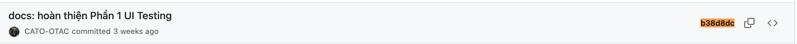 |
| 2 | Write and revise the UI-testing comparison matrix and selection rationale | TBC | `Tool_Survey_Proposal.md`; commit `b38d8dc`  |
| 3 | Update Week 4 progress and AI-use reporting for the UI-testing survey | TBC | `weekly_reports/weekly_report_w4.md`; commit `3a4c4af` 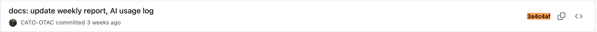 |
| 4 | Add Gemini-session evidence for the UI-testing tool survey | TBC | `ai-disclosure/screenshots/Nguyen Binh An/`; commit `3a4c4af`  |
| 5 | Act as group lead and own presentation/facilitation integration | TBC | Team-role table in `README.md`; section ownership in final submission |

## 3.2 Phạm Ngọc Gia Bảo - 23127027

| No. | Task description | Hours | Evidence |
|---:|---|---:|---|
| 6 | Scaffold the seminar repository and initial team documentation | TBC | Commit `955cf9b` 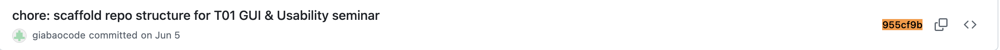 |
| 7 | Draft the initial tool-survey proposal and tool pairing | TBC | Commit `541b7b8` 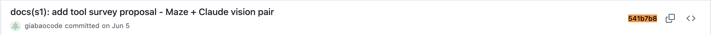 |
| 8 | Create the Stage S2 scope-note skeleton for instructor review | TBC | Commit `9192b4f` 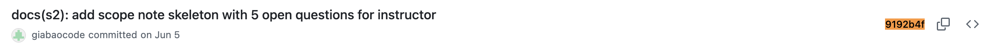 |
| 9 | Create initial User Guide, Activity Worksheet, and slide-outline skeletons | TBC | Commit `423b602` 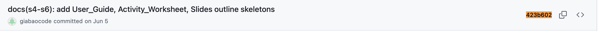 |
| 10 | Translate and normalize repository content for the team | TBC | Commit `f5c3b85` 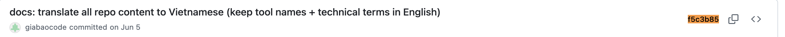 |
| 11 | Build the usability deep-study/Maze study skeleton without fabricated results | TBC | `DeepStudyHandsOn.md`; commit `f765f63` 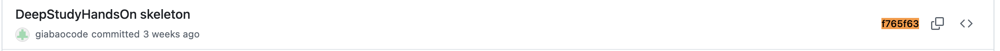 |
| 12 | Prepare and document the Maze checkout study draft | TBC | `maze_checkout_task_outline_draft.png`; commit `f765f63`  |
| 13 | Write the Maze usability User Guide and inspect the EShop checkout flow | TBC | `User_Guide.md` on branch `origin/Bao/user_guider_V1`; commit `dc38854` 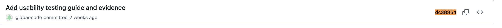 |
| 14 | Record AI-use evidence and weekly-report evidence for usability work | TBC | Branch evidence under `ai-disclosure/screenshots/PNGBAO/` and `weekly_reports/usability_evidence/` |

## 3.3 Lee Kun Da - 23127035

| No. | Task description | Hours | Evidence |
|---:|---|---:|---|
| 15 | Create the report frame and organize course reference files | TBC | Commit `95333ea` 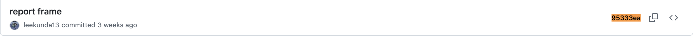 |
| 16 | Draft the usability-testing portion of the tool survey | TBC | Commit `762b928` 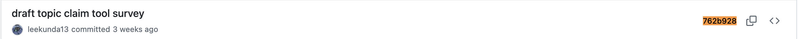 |
| 17 | Complete and rename the usability tool-survey deliverable | TBC | Commit `cacbacd` 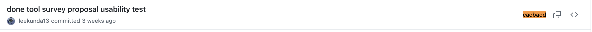 |
| 18 | Add Gemini/Claude AI-use evidence for the tool survey | TBC | `ai-disclosure/screenshots/Lee Kun Da/`; commits `4e3f6e2`, `cacbacd` 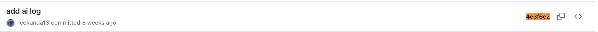  |
| 19 | Maintain Week 4 and Week 5 progress reports | TBC | Commits `e06dd35`, `6c7b1fb`, `ce1ec63` 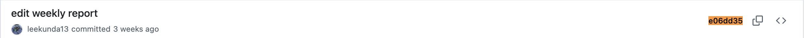 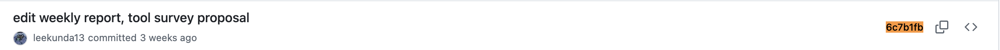 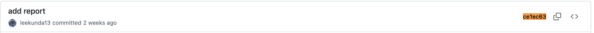 |
| 20 | Edit the Maze usability User Guide on the dedicated branch | TBC | Branch `origin/Da/user_guide`; commit `090be8f`; AI-session evidence `submission/assets/ai-evidence/lee_ui guide summary.png` 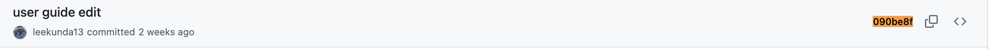 |

## 3.4 Lưu Ngô Quốc Bảo - 23127327

| No. | Task description | Hours | Evidence |
|---:|---|---:|---|
| 21 | Write and revise the Manual UI Testing + Claude Vision deep-study section | TBC | `DeepStudyHandsOn.md`; commits `18c2b8a`, `87913f2` 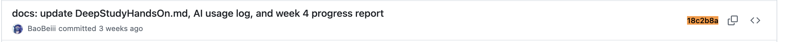 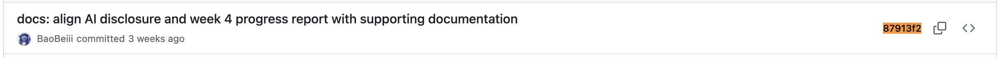 |
| 22 | Maintain Week 4 task reporting and AI-use declarations | TBC | `weekly_reports/weekly_report_w4.md`; commits `f9c0528`, `690452f`, `67a4fce` 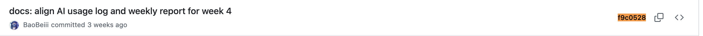 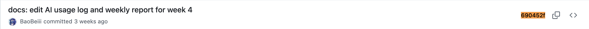 |
| 23 | Add screenshots documenting AI-assisted deep-study work | TBC | `ai-disclosure/screenshots/Luu Ngo Quoc Bao/deep_study_hands_on_summary_*.png` |
| 24 | Create the Manual UI Testing User Guide with BrowserStack and Claude Vision | TBC | `UserGuide_UI_Testing.md`; commit `d7e1d4a` 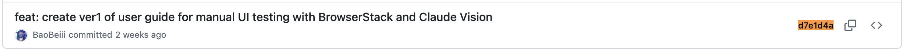 |
| 25 | Inspect SUT setup information and document ports, accounts, and coupon cases | TBC | `UserGuide_UI_Testing.md`; commit `d7e1d4a`  |
| 26 | Document human-audit, troubleshooting, and AI failure-mode controls | TBC | `UserGuide_UI_Testing.md` Sections 3-5 |
| 27 | Add AI-use evidence for the UI User Guide | TBC | `ai-disclosure/screenshots/Luu Ngo Quoc Bao/Screenshot 2026-07-11*.png` |

# 4. Team validation

Before signing off:

- [ ] Each task is owned by no more than two members.
- [ ] Every member has at least five tasks.
- [ ] Each member has entered actual hours for their own rows.
- [ ] The team has checked the Git alias mapping and commit count.
- [ ] The final percentages reflect tasks, hours, Git evidence, and work quality.
- [ ] The four final percentages sum to 100%.
- [ ] No grey/TA-only score field has been edited.

| Student | Confirmation | Date |
|---|---|---|
| Nguyễn Bình An | ______________________________ | __________ |
| Phạm Ngọc Gia Bảo | ______________________________ | __________ |
| Lee Kun Da | ______________________________ | __________ |
| Lưu Ngô Quốc Bảo | ______________________________ | __________ |
