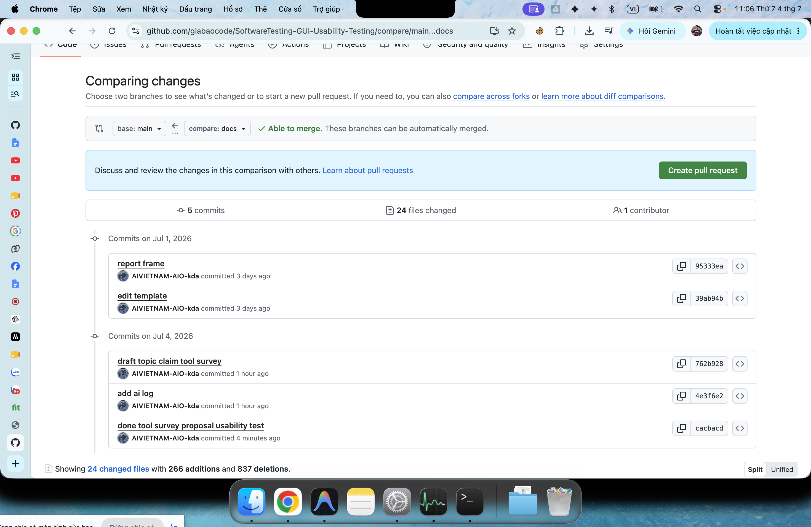
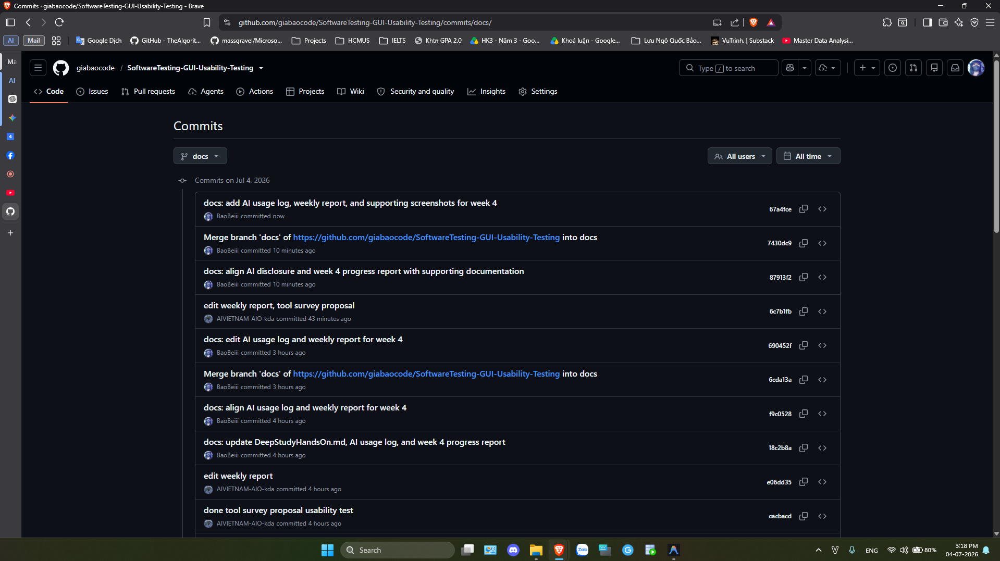
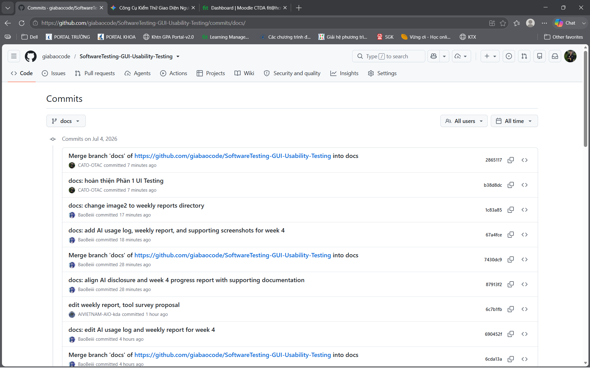

# Weekly Report - Week 4

## 1. General Information
- **Group:** 3
- **Project Name:** UI & Usability Testing
- **Date range:** 29/6/2026 - 4/7/2026

---

## 2. Tasks Completed This Week

### 23127035 - Lee Kun Da
- **Task 1:** Tìm hiểu các tool cho Usability testing
- **Task 2:** Viết Tool_Survey_Proposal phần Usability testing
- **Evidence:** 

### 23127327 - Lưu Ngô Quốc Bảo
- **Task 1:** Viết phần UI Testing (Section II) cho `deep_study_hands_on.md` — lý thuyết Manual UI Testing + Claude Vision, hands-on, kết quả, troubleshooting
- **Task 2:** Điền AI Usage Declaration và tạo AI Usage Log
- **Evidence:** 

### 23127149 - Nguyễn Bình An
- **Task 1:** Tìm hiểu và phân tích các công cụ UI Testing (Manual UI Testing, Browserstack, Claude Vision) cho `Tool_Survey_Proposal`
- **Task 2:** Viết Phần 1 - UI Testing trong `Tool_Survey_Proposal.md` (khảo sát công cụ, bảng so sánh tiêu chí, quyết định lựa chọn kết hợp 3 công cụ)
- **Evidence:** 

### [Mã số SV 3] – [Họ và Tên 3]
- **Task 1:** [Mô tả công việc 1]
- **Task 2:** [Mô tả công việc 2]
- **Evidence:** 

*(Lưu ý: Mỗi task chỉ nên được thực hiện bởi 1 đến 2 thành viên, không nhiều hơn).*

---

## 3. AI Usage Declaration
*Mô tả cách nhóm bạn sử dụng các công cụ AI trong tuần này (nếu có).*

### Deep study hands-on - Lưu Ngô Quốc Bảo
- **Công cụ đã dùng:** Claude, Gemini
- **Mục đích sử dụng:** Claude hỗ trợ gợi ý nội dung, cấu trúc bài viết cho phần UI Testing trong `DeepStudyHandsOn.md` (Manual UI Testing + Claude Vision UI Review); Gemini hỗ trợ tóm tắt toàn bộ nội dung và tiến trình làm việc của session hiện tại.
- **Minh chứng**: 

### Tool_Survey_Proposal - Lee Kun Da
- **Công cụ đã dùng:** Claude, ChatGPT
- **Mục đích sử dụng:** hỗ trợ tìm hiểu các tool, so sánh các tool
- **Minh chứng**:

- **Chi tiết log:** Xem [`ai-disclosure/AI_Usage_Log.md`](../ai-disclosure/AI_Usage_Log.md)

### Tool_Survey_Proposal (Phần UI Testing) - Nguyễn Bình An
- **Công cụ đã dùng:** Gemini
- **Mục đích sử dụng:** hỗ trợ tìm hiểu các công cụ, so sánh các công cụ
- **Minh chứng**:

---

## 4. Tasks Planned for Next Week
- **Task 1:** Thực hiện user-guide và record demo cho Usability test - *Lee Kun Da*
- **Task 2:** Thực hiện user-guide và record demo cho Usability test - *Phạm Ngọc Gia Bảo*
- **Task 3:** Thực hiện user-guide và record demo cho UI test - *Lưu Ngô Quốc Bảo*
- **Task 4:** Thực hiện user-guide và record demo cho UI test - *Nguyễn Bình An*
---

## 5. Issues
*Liệt kê các vấn đề (issues) mà các thành viên trong nhóm gặp phải và giải thích cách nhóm đã giải quyết (hoặc lý do chưa giải quyết được).*

### Tool_Survey_Proposal - Lee Kun Da
- **Issue 1:** Nhiều tools trên thị trường cần trả phí và gói free còn nhiều giới hạn. Cần phải chọn ra tool đảm bảo thực hiện seminar tốt
  - **Cách giải quyết:** nhờ sự hỗ trợ của Gemini và Claude thực hiện tìm hiểu và so sánh nhiều tool khác nhau để đưa ra lựa chọn. Sẽ thực hành trên tool để kiểm chứng độ phù hợp ở tuần sau

### Tool_Survey_Proposal (Phần UI Testing) - Nguyễn Bình An
- **Issue 1:** Khó xác định tiêu chí so sánh khách quan giữa 3 phương pháp có bản chất khác nhau (con người, hạ tầng cloud, AI), dẫn đến việc lập bảng so sánh ban đầu bị thiên lệch, ưu tiên quá nhiều vào tiêu chí chi phí mà bỏ sót các yếu tố như khả năng phát hiện lỗi UX hay mức độ tự động hóa.
  - **Cách giải quyết:** Nhờ Gemini hỗ trợ rà soát lại và đề xuất thêm các tiêu chí đánh giá cân bằng hơn (Learning Curve, EShop Fit, AI Capability, Community), sau đó nhóm cùng thảo luận để chốt bộ tiêu chí chung áp dụng cho cả Phần 1 và Phần 2 của report.
- **Issue 2:** Chưa có dữ liệu thực tế (chưa test trực tiếp) trên Browserstack do giới hạn tài khoản free trial, nên phần đánh giá "Ưu điểm/Nhược điểm" chủ yếu dựa trên tài liệu và tổng hợp từ AI, có thể chưa phản ánh đúng trải nghiệm thực tế khi dùng cho dự án EShop.
  - **Cách giải quyết:** Ghi chú rõ đây là đánh giá sơ bộ dựa trên khảo sát tài liệu; dự kiến sẽ đăng ký thử nghiệm thực tế (hands-on) ở tuần sau để kiểm chứng và bổ sung minh chứng cụ thể.